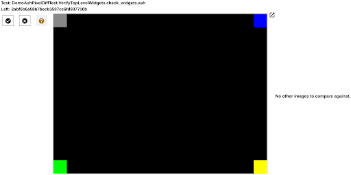
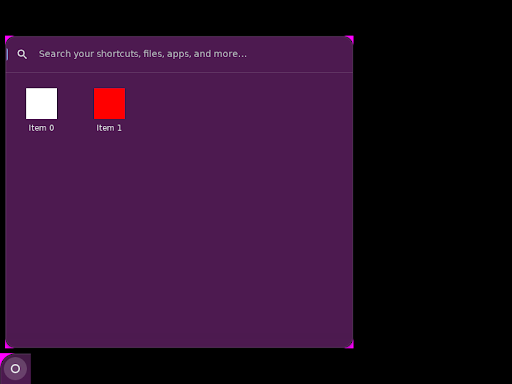
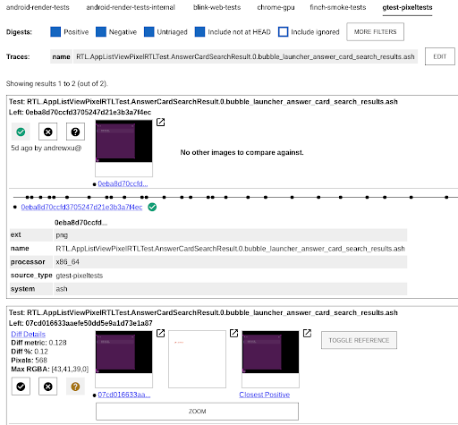

# Ash Pixel Unit Testing

## 1. Overview

Ash pixel unit testing is image-based testing, backed by
[Skia Gold][1]. It takes screenshots
in test code then compares the captured screenshots with benchmark images
pixel-by-pixel. Therefore, ash pixel unit testing can check the UI features that
could be hard to verify through ordinary ash unit tests, such as the appearance
of a gradient shader.

## 2. Your First Pixel Diff Test

This section teaches how to add a simple test that verifies widgets on the
primary screen. The code below has been
[landed][2]. If you are not familiar with Chrome testing, read
this [doc][3] first.

### 2.1 Sample Code

~~~c++
class DemoAshPixelDiffTest : public AshTestBase {
 public:
  // AshTestBase:
  absl::optional<pixel_test::InitParams> CreatePixelTestInitParams()
      const override {
    return pixel_test::InitParams();
  }

  // … unrelated code
 };

// Create top level widgets at corners of the primary display. Check the
// screenshot on these widgets.
TEST_F(DemoAshPixelDiffTest, VerifyTopLevelWidgets) {
  auto widget1 = …
  auto widget2 = …
  auto widget3 = …
  auto widget4 = …
  EXPECT_TRUE(GetPixelDiffer()->CompareUiComponentsOnPrimaryScreen(
      "check_widgets", widget1.get(), widget2.get(), widget3.get(),
      widget4.get()));
}
~~~

DemoAshPixelDiffTest is a subclass of AshTestBase, just like the ordinary ash
unit tests. But there is one difference here: DemoAshPixelDiffTest overrides
CreatePixelTestInitParams() to return pixel test initialization params. When
pixel test init params are existent, an AshPixelDiffer instance is built during
test setup. AshPixelDiffer is a wrapper of Skia Gold APIs that capture
screenshots, upload screenshots to the Skia Gold server and return pixel
comparison results. AshTestBase exposes the AshPixelDiffer instance by
GetPixelDiffer().

The sample code’s test body adds four widgets then it checks these widgets by
calling CompareUiComponentsOnPrimaryScreen(), an API provided by AshPixelDiffer
to compare the pixels of the given UI components (such as views::view,
views::widget and aura::Window) with the benchmark image’s. This doc will give
more details of AshPixelDiffer APIs later.

### 2.2 Run Locally

The build target of ash pixel unit tests is `ash_pixeltests`. A sample command
to build tests:

~~~bash
.../chrome/src $ autoninja -C out/debug ash_pixeltests
~~~

The command to run the sample pixel unit test:

~~~bash
.../chrome/src $ out/debug/ash_pixeltests --gtest_filter=DemoAshPixelDiffTest.
VerifyTopLevelWidgets
~~~

Options of running pixel tests:

- --skia-gold-local-png-write-directory=DIR: this option specifies a directory
to save the screenshots captured in pixel testing. DIR is an absolute path to
an existing directory. Note that a relative file path does not work. The saved
screenshots’ names follow the rule illustrated in section 2.4. The screenshots
generated by local runs could be slightly different from those generated by CQ
runs due to different hardware.

- --bypass-skia-gold-functionality: when this option is given, the image
comparison functions such as AshPixelDiffTestHelper::ComparePrimaryFullScreen()
always return true. Usually this option is used along with
skia-gold-local-png-write-directory when comparing with benchmark is not needed,
e.g. a user is developing a new test case, which means that the benchmark image
does not exist yet.

### 2.3 Update Benchmarks

When running a CL that adds a new benchmark or generates a different screenshot
from the benchmark, Gerrit should show pixel testing failures in a red box
(see Fig 1). The CL cannot be submitted without solving this test failure.

|        |
| :---------------------------------------: |
| Fig 1: the red box of an untriaged digest |

After clicking the red box, you should see a webpage named “Chrome Public Gold”
that shows the image difference details. Skia Gold has a term for it: Untriaged
Digest. Fig 2 is the untriaged digest generated when adding the sample code.
Because the sample code adds a new benchmark image, the digest shows “No other
images to compare against”.

|           |
| :------------------------------------------: |
| Fig 2: the untriaged digest of the demo test |

If a CL generates a screenshot different from the benchmark image, the digest
should contain three images:
- the new screenshot (left)
- the difference between the new one and the current benchmark (middle)
- the current benchmark (right)

Fig 3 shows such a digest generated by a [CL][4] that moves a widget.
Through the digest we can tell that one square has moved

|                           |
| :----------------------------------------------------------: |
| Fig 3: the untriaged digest from by a CL that moves a widget |

Click on the tick button if you would like to accept the change (see Fig 4).
After clicking, the failed pixel test will be passed. Note that the new
benchmark is committed to the Skia Gold server and affects other CQ runnings
only after you land the CL. This doc will introduce how to find the committed
benchmarks in later sections.

|                  |
| :-------------------------------------------------: |
| Fig 4: an example of accepting the benchmark change |

**Attention**: rarely a red rectangle does not show but the linux-chromeos-rel
bot status shows ash_pixeltests has failures. In this case, go to the log of
ash_pixeltests by clicking **stdout raw** (see Fig 5). Then search “Untriaged or
negative image” in the log. You can find the links to untriaged digests.
This issue is tracked [here][5].

|  |
| :---------------------------------: |
|    Fig 5: ash_pixeltests result     |

### 2.4 Where to Find the Committed Benchmarks

All committed benchmarks are listed in this [link][6]. Each benchmark’s name
follow this rule: {Test Suite Name}.{Test Case Name}.{Screenshot Name}.
{Platform Suffix}, where:

- {Test Suite Name}: it is the test class’s name. In the sample code, it is
“DemoAshPixelDiffTest”.
- {Test Case Name}: In the sample code, it is “VerifyTopLevelWidgets”.
- {Screenshot Name}: it is the string specified when taking the screenshot.
In the sample code, it is “check_widgets”.
- {Platform Suffix}: it indicates the platform on which the screenshot is taken.
For ash pixel tests, it is always “ash”.

Therefore, the full name of the benchmark image added by the sample code is
`DemoAshPixelDiffTest.VerifyTopLevelWidgets.check_widgets.ash`.

In a parameterized test, “/” used by the TEST_P macro is replaced by “.” since a
backlash leads to an illegal file path. Take the following code as an example:

~~~c++
INSTANTIATE_TEST_SUITE_P(RTL, AppListViewPixelRTLTest, testing::Bool());

TEST_P(AppListViewPixelRTLTest, Basics) {
  // … unrelated code
  EXPECT_TRUE(GetPixelDiffer()->CompareUiComponentsOnPrimaryScreen(
    "bubble_launcher_basics", …);
}
~~~

The names of the committed screenshots are:

- RTL.AppListViewPixelRTLTest.Basics.0.bubble_launcher_basics.ash
- RTL.AppListViewPixelRTLTest.Basics.1.bubble_launcher_basics.ash

## 3. More Use Cases

### 3.1 Customize Test Setup

You can customize the `pixel_test::InitParams` structure. For example, you can
create a pixel test to verify the right-to-left UI layout in the code below:

~~~c++
class DemoRTLTest : public AshTestBase {
 public:
  // AshTestBase:
  absl::optional<pixel_test::InitParams> CreatePixelTestInitParams()
      const override {
    pixel_test::InitParams init_params;
    init_params.under_rtl = true;
    return init_params;
  }
  // … unrelated code
};
~~~

### 3.2 Screenshot Capture APIs

Use AshPixelDiffTestHelper::CompareUiComponentsOnPrimaryScreen() to take
screenshots and get pixel comparison results. Besides the screenshot name
string, this function accepts any number of views::view pointers, aura::window
pointers and views::widget pointers. In the screenshot taken by this API, only
the pixels within the screen bounds of the objects referred to by the given
pointers are visible. Note that the screenshot is still in the size of the
display.  In the benchmark image generated by the previous sample code, only the
widgets at corners are visible while the remaining area is covered by pure black
color.

Here is another [example][7] that compares the pixels within the app list bubble
view and the shelf navigation widget:

~~~c++
// Verifies the app list view under the clamshell mode.
TEST_P(AppListViewPixelRTLTest, Basics) {
  // …
  EXPECT_TRUE(GetPixelDiffer()->CompareUiComponentsOnPrimaryScreen(
                   "bubble_launcher_basics",
      GetAppListTestHelper()->GetBubbleView(),
      GetPrimaryShelf()->navigation_widget()));
}
~~~

See Its benchmark image in Fig 6.

|                                       |
| :----------------------------------------------------------------------: |
| Fig 6: benchmark image generated by CompareUiComponentsOnPrimaryScreen() |

## 4. Best Practices

### 4.1 Attention on Obsolete Benchmarks

Currently, the Skia Gold benchmark images are not branch based. For example, if
a CL introduces an intentional UI update that changes a pixel tests’s benchmark
image A to image B, after this CL is landed, both image A and image B are valid.
In other words, from the perspective of Skia Gold, a user always adds benchmark
images. In the current setting of Skia Gold, a benchmark image is deleted if
this benchmark is not matched by any screenshot generated by CLs over a time
threshold (~30 days).  A Skia Gold user can view all benchmark images associated
with a test from the console by adding the option“include not at HEAD”
(see Fig 7).

|                           |
| :----------------------------------------------------------- |
| Fig 7: benchmark images when including “include not at HEAD” |

Hence, it is convenient to revert or cherry pick a CL that updates pixel test
benchmark images. The downside is: if a CL leads to a regression to generate a
screenshot that happens to be the test’s obsolete benchmark, this CL cannot be
caught by pixel testing.

This issue can be mitigated by changing the screenshot name when updating a
benchmark. We recommend test writers to include version numbers in screenshot
names. For example, use “Foo.rev_1” rather than “Foo” as the screenshot name.
After a benchmark update, the screenshot name becomes “Foo.rev_2”. Including a
version number in name is a recommendation rather than a requirement.

### 4.2 Flakiness

If a screenshot is unstable, its associated pixel test could be flaky. To ensure
a stable UI, pixel test during setup does the following jobs:

- Use a predefined value in the time view
- Use a predefined battery state so that battery icon in the shelf is constant
- Use a predefined wallpaper

Despite this, there are still some factors leading to flaky pixel tests. Some
common flakiness sources are listed below:

- Blinking views: some views are designed to blink, such as text field cursors.
A quick fix is to hide the blinking views.
- gfx::Animation: The duration of gfx::Animation (including its subclass such as
gfx::SlideAnimation) may not be zero even under
ScopedAnimationDurationScaleMode::ZERO_DURATION. A running animation often makes
a pixel test flaky. A quick fix is to ensure gfx::Animation’s duration to
respect ScopedAnimationDurationScaleMode. Here is an [example][8].

Test writers should ensure that the UI is stable when taking screenshots. Skia
Gold also provides [fuzzy comparison][9] to tolerate pixel differences under a
threshold.

### 4.3 Code Review on Benchmark Updates

Recall that when a CL adds or updates benchmarks, a red box shows. Before the CL
author accepts the benchmark change, a code reviewer can view the change by
simply clicking on the red box to open an untriaged digest.

However, if a CL author has accepted benchmark changes, it takes more effort to
find these changes. The steps to show approved benchmark changes associated with
a CL are listed below:

1. Click on the gray box (see Fig 8) on the Gerrit page.It could show an error
message demonstrated in Fig 9 but just ignore it.

|     |
| :------------------------------------: |
| Fig 8: the gray box on the Gerrit page |

|                                        |
| :-----------------------------------------------------------------------: |
| Fig 9: the error message that could show when opening an untriaged digest |

2. Click the “Triagelog” to view benchmark updates (see Fig 10).

|   |
| :-----------------------------------: |
| Fig 10: the screenshot of “Triagelog” |

Given that finding the approved benchmark updates is less straightforward, we
recommend a CL author not approve benchmark updates until they get all LGTMs. A
code reviewer should check the benchmark updates introduced by the CL under
review. We are actively talking with the Skia Gold team to [improve UI][10].

### 4.4 Use Screenshots for Debugging

[TakePrimaryDisplayScreenshotAndSave()][11] is a debugging helper function that
takes a screenshot of full screen. You can use it for debugging even on
non-pixel ash unit tests.

[1]: https://skia.org/docs/dev/testing/skiagold/
[2]: https://source.chromium.org/chromium/chromium/src/+/main:ash/test/pixel/demo_ash_pixel_diff_test.cc
[3]: https://www.chromium.org/developers/testing/running-tests/
[4]: https://crrev.com/c/3974168
[5]: https://bugs.chromium.org/p/skia/issues/detail?id=13862
[6]: https://chrome-gold.skia.org/list?corpus=gtest-pixeltests
[7]: https://source.chromium.org/chromium/chromium/src/+/main:ash/app_list/views/app_list_view_pixeltest.cc;l=51;drc=fb810baadf0664a201b6eb3c90a777964032517c;bpv=1;bpt=0
[8]: https://crrev.com/c/3806105
[9]: https://source.chromium.org/chromium/chromium/src/+/main:ui/base/test/skia_gold_matching_algorithm.h
[10]: https://bugs.chromium.org/p/skia/issues/detail?id=13863
[11]: https://source.chromium.org/chromium/chromium/src/+/main:ash/test/ash_test_util.h;l=35;drc=b0602450683de8115bb413845212d68789d9a0b1;bpv=1;bpt=0
